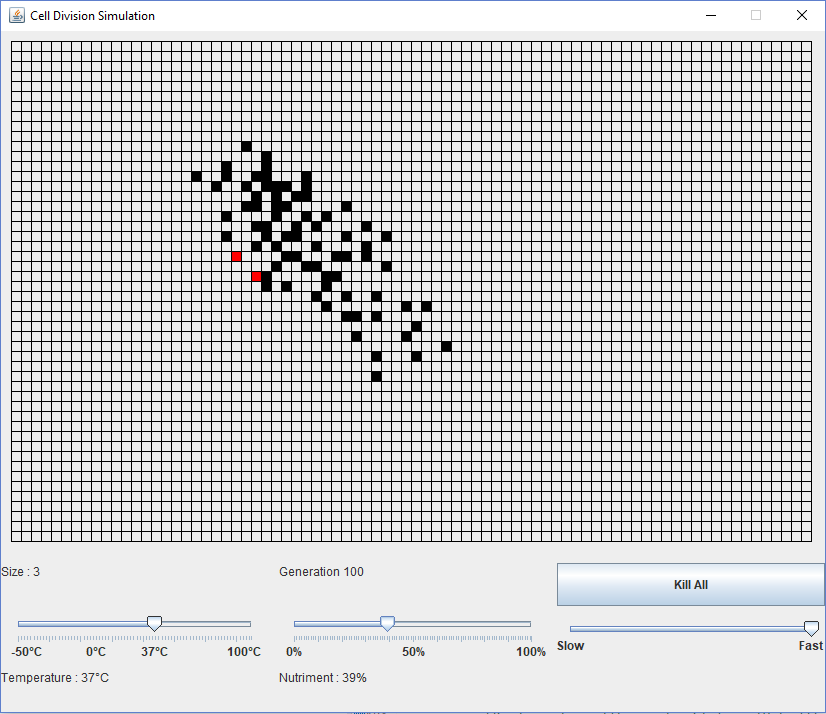

# CellDivision

A simple simulation modelizing the growth of a population of cells.

Each cell has a chance of replicating via mitosis (1 cell gives 2 identical cells).

The population starts with one cell.

Environment factors will impact the replication rate (heat, nutrients, speed).

